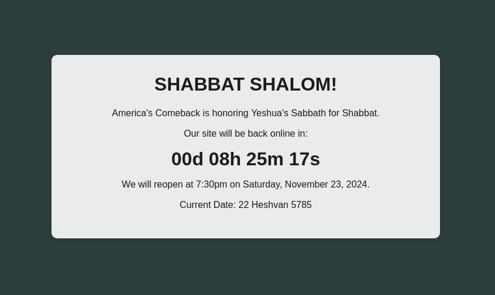

# IPS.Shabbat

This plugin allows you to observe the Sabbath on your IPS Community that is self-hosted.



## Installation

| Property | Value |
|----------|-------|
| IPS Community | `/var/www/ips` |
| PHP           | 8.1.27 |
| Linux         | Rocky 9 |
| Database      | MariaDB |

1. Install the `shabbat.php` script inside your `/var/www/ips` directory so it lives at `/var/www/ips/shabbat.php` and has the owner of `apache` with the group of `apache` and permissions of `0644`.
2. Add `DirectoryIndex shabbat.php index.php index.html index.htm` to the `.htaccess` at `/var/www/ips/.htaccess`

```bash
[rocky@localhost ~ /var/www]$ git clone https://github.com/andreimerlescu/ips.shabbat.git
[rocky@localhost ~ /var/www]$ cp ips.shabbat/shabbat.php ips/shabbat.php
[rocky@localhost ~ /var/www]$ echo "DirectoryIndex shabbat.php index.php index.html index.htm" | tee -a /var/www/ips/.htaccess > /dev/null

[rocky@localhost ~ /var/www]$ # POST-INSTALL CLEANUP
[rocky@localhost ~ /var/www]$ rm -rf ips.shabbat
```

Now, when you visit your community, you'll see that it loads itself through the `shabbat.php` script first, then if its not Shabbat, it redirects to the `index.php` page; otherwise it halts execution of the request and displays the observance notice.

## Uninstall

To remove this package, simply remove the `shabbat.php` script. To prevent its zombie from returning, remove the `DirectoryIndex` line in the `.htaccess` file.

## Support

If you wish to modify this plugin, submit a pull request.

## Usage

This plugin is free to use. It is 100% free to use and comes with no guarantees, assurances or ANYTHING OTHER THAN USE AT YOUR OWN RISK. The software is open source so you can see exactly what the script does, but always verify before trusting blindly. 

## Why This Package Exists

Some of you may be wondering why this package exists. I'll share with you the words that the Lord Yeshua Ha'Maschiah has shared with me, a sinning rack of dust whom Yeshua has saved.... "observance of the Sabbath is not a choice if you want favor with YeHoVah," thus observing the Sabbath is a choice not only for an individual to choose to make; but if you're a decision maker with authority over other people's lives; by asserting the observance of the Sabbath you are giving the Lord a chance to touch the hearts of the individual who reaches your community to return them to God so they too may have eternal Salvation in the transformative power of the Holy Ghost once you call upon the Ha'Maschiah, Our Yeshua. I built this upon His request for me, and this package exists because you are to use it if you feel a calling to observe the Sabbath for your community.
